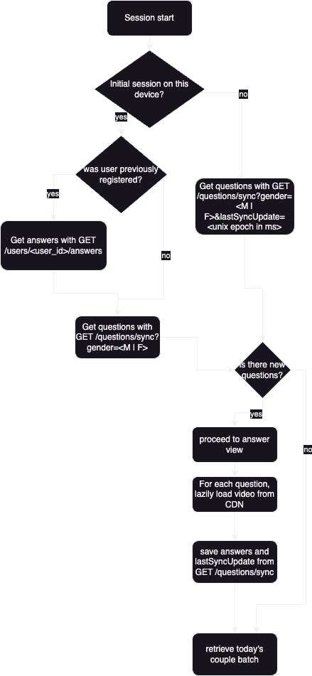

# Crystal Ball Feature description

Context - Crystal ball feature
In stroll, the UX for FEMALES and MALES are slightly different
Naturally, Men can put in more "work" whilst females get to be a bit more picky.
Here is part of the feature explained below on how it works.

1. Plan out how you would design and execute this BE
   wise with dummy endpoints for FE
2. Make sure there are no edge cases left and deliver the
   end result in what you deem to be effective
   eg. flowchart / writeup / combination to pass to a
   talented and conscientious BE Junior to execute.
3. take note - Every question has their own 10-15s looping
   HD video...

### Considerations

1. There is an ELO scoring system - but you can just ignore it in your final flowchart/writeup plan -
   Can just put "Algorithm filter" for your task.
2. Imagine you have a very capable FRONTEND JUNIOR for this task - but you must take the lead in
   the key planning points.
3. Build it to assume that product team will remove / add new questions in the future added to
   question pool - Men will have to answer new question when added.
4. Product will mark 7 questions out of N questions from the questions pool.

#### Female logic

- Every day girls will get a question of the day out of the 7 questions
- They select their answer to get a certain kind of guy
    * A - x14 (A profiles)
    * B - x14 (B profiles)
    * IDK - 50/50 profiles
- Where they can later send a like...

#### Male logic

- Guys have to answer 7 questions when they onboard. Answers can be edited in their edit profile
- Afterward - guys get < x number> of profiles a day from an algorithm scoring system (without this QOTD feature)

# Design

## Infrastructure

- Media CDN: with CDN we ensure that video will be delivered fast from nearest edge server. We will use AWS S3 as a
  storage and Amazon CloudFront as CDN for a VOD (Video on Demand)
- Backend services: RESTful API for questions and answers as well as question syncing

## Database

```sql
CREATE TABLE questions (
id SERIAL PRIMARY KEY,
video_key VARCHAR(255) NOT NULL,
-- We need to recalculate order of questions when one is deleted
question_order INTEGER NOT NULL,
created_at TIMESTAMP WITH TIME ZONE NOT NULL DEFAULT NOW(),
updated_at TIMESTAMP WITH TIME ZONE NOT NULL DEFAULT NOW(),
deleted_at TIMESTAMP WITH TIME ZONE,
);


CREATE TABLE question_translations (
id SERIAL PRIMARY KEY,
question_id INTEGER NOT NULL REFERENCES questions(id) ON DELETE CASCADE,
locale VARCHAR(10) NOT NULL,
text TEXT NOT NULL,
UNIQUE (question_id, locale)
);

CREATE TABLE question_answers (
id SERIAL PRIMARY KEY,
question_id INTEGER NOT NULL REFERENCES questions(id) ON DELETE CASCADE,
weight NUMERIC(3,2) NOT NULL,
CONSTRAINT uq_answer_order UNIQUE (question_id, weight)
);


CREATE TABLE question_answer_translations (
id SERIAL PRIMARY KEY,
answer_id INTEGER NOT NULL REFERENCES question_answers(id) ON DELETE CASCADE,
locale VARCHAR(10) NOT NULL,
text TEXT NOT NULL,
UNIQUE (answer_id, locale)
);

CREATE TABLE user_answers (
id SERIAL PRIMARY KEY,
user_id INTEGER NOT NULL REFERENCES users(id) ON DELETE CASCADE,
question_id INTEGER NOT NULL REFERENCES questions(id) ON DELETE CASCADE,
answer_id INTEGER REFERENCES question_answers(id),
created_at TIMESTAMP WITH TIME ZONE NOT NULL DEFAULT NOW(),
-- User cannot have multiple answers to the same question.
CONSTRAINT uq_user_question UNIQUE (user_id, question_id),
CONSTRAINT fk_valid_answer FOREIGN KEY (question_id, answer_id)
REFERENCES question_answers(question_id, id)
);

-- in this table we will store our global configs. For now we will insert only 
-- key = "question_limit", value = 7 and key = "daily_batch_limit", value = 14
CREATE TABLE app_config (
key VARCHAR(50) PRIMARY KEY,
value TEXT NOT NULL
);

```

Endpoints:

Headers for all requests:
Authorization: Bearer <jwt_token> (assume we use JWT for auth, not relevant for this task)
X-Language: <language in ISO 639-1>

- GET /question/sync?fromDate=<unix epoch>&gender=<F | M> (QS fromDate unix epoch is optional)
- PUT /question/<question_id>/answer
- GET /user/<user_id>/answers

### Logic

- First, to create and store questions, we need to make admin dashboard, where admin make CRUD operations on questions
  and related videos. NOTE: on delete, we should make a soft delete (aka mark it as deleted, in this case by adding
  timestamp to deleted_at field), recalculate questions order.
- When question and attached video is added or updated, we need to convert video to needed format and then upload to S3
- When user is registered, client should send GET /question/sync?gender= to get the initial question pool. On the server
  side we either chose <query_limit> questions from database (ordered by question_order, where deleted_at is null) if
  gender is male, or random question from the same pool if gender is female and return it. Data from endpoint should be:
  {
  "lastSyncUpdate": 1729614123000(example unix epoch in ms),
  "newQuestions": [...],
  "updatedQuestions": [...],
  "deletedQuestionIds": [...]
  }
- For female, we can just ignore updated and deleted questions, just get the first one from newQuestions -
  this will be our QOTD.
- On client side we need to save lastSyncUpdate. When question view is mounted, we need to start video stream from CDN.
  Note for a frontend dev: to create smooth experience, add fade out effect on video.
- When question is answered, we need to send <{question_id, answer_id}> via PUT /question/<question_id>/answer and save
  it to the database locally.
  Note: what if user will quit the app before answering all questions? We can save the last question_id and answer_id to
  the local storage and continue from this point when user will return.
- When all questions are answered, proceed to request couple batch of the day. On the server side, because we have
  question_id, answer_id and weight, we can easily compare them (left answer's weight would be 0, idk would be 0.5 and
  right answer's weight would be 1) and retrieve x (where x is <daily_batch_limit>) suitable couples using <algorithm>
- On next sessions, we need to send GET /question/sync?fromDate=<lastSyncUpdate>&gender=<gender> to sync questions
  from the last sync date. For females, because they get only one question per day, we check if lastSyncUpdate is today,
  and if it's not, we send new question, otherwise just send empty array. For males, we check for new, updated and
  deleted questions and update the local database accordingly. For both genders, if there are new questions, proceed to
  them.

### Points to note for a frontend dev

- If session is long, consider long polling to sync questions.
- When user changes app language, we need to send X-Language header with the language code to get questions in the
  correct language.
- If user was previously logged in, we need to send GET /user/<user_id>/answers to get the answers and continue from
  the last question.

### Points to note for a backend dev

- Add validation of the qs parameters, fromDate should be < current time, gender should be enum F | M
- Check authorization, when user is demanding changes, only user with the same id can change its data.
- Order questions and answers by question_order and weight fields respectively.
- Limit questions to <question_limit> and daily batch to <daily_batch_limit>. There could be a case when there are not
  enough questions in the pool, in this case we should return all available questions, so if we decide to add more
  questions, we can easily do it without changing the logic by adding extra questions and updating question_limit


### Flowchart for FE Junior


